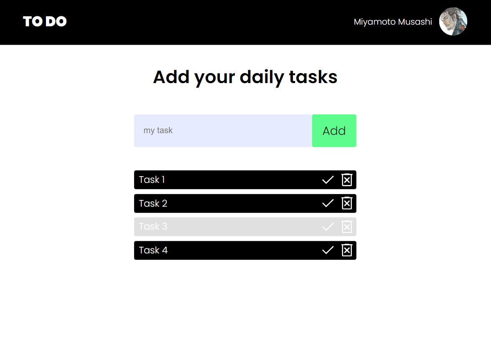

# Todo-App

;

This is a simple todo application built with 
- React & TypeScript.
It allows users to create, and delete tasks, as well as mark them as completed. 

## Installation

To install and run the application, you can use the following commands:

```
git clone <repo-url>
cd todo-app
npm install
npm start
```


## Pre-usage

If the user's local storage already contains items named "tasks" or "user", the app may not work correctly, so it's adviced to clear the local storage if some of the variable names cross.

## Usage

To use the application, simply add a task to the input field and press enter. To delete a task, click on the trash icon.

## Contributing

Contributions are welcome! If you would like to contribute to the project, please fork the repository and submit a pull request. 

## Links

- Solution URL: [GitHub](https://github.com/gabadadzeluca/todo-app-unilab)
- Live Site URL: [Live URL](https://gabadadzeluca.github.io/todo-app-unilab/)

## Contact

You can find me on LinkedIn at <https://www.linkedin.com/in/luca-gabadadze-6068b324a/> or email me at <gabadadzeluca@gmail.com>.
